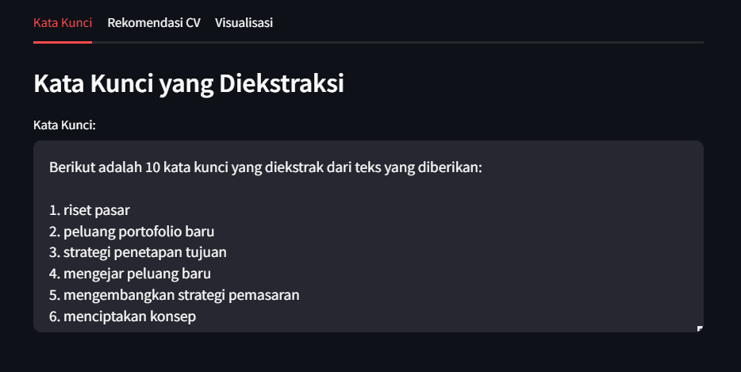

# Job Keyword Extractor

## Deskripsi

Aplikasi Job Keyword Extractor adalah sebuah alat berbasis Python yang dirancang untuk membantu pencari kerja meningkatkan peluang mereka dalam melewati sistem pelacakan pelamar (Applicant Tracking System - ATS). Aplikasi ini menggunakan teknik ekstraksi kata kunci untuk menemukan kata kunci penting dari deskripsi pekerjaan dalam lowongan kerja, sehingga pengguna dapat menyesuaikan resume mereka dengan lebih baik.

## Fitur Utama

- **Ekstraksi Kata Kunci:** Aplikasi ini menggunakan kombinasi model _Artificial Intelligence_ untuk mengekstrak kata kunci dari deskripsi pekerjaan yang diinput oleh pengguna dan menyediakan contoh deskripsi dari kata kunci yang digunakan.

- **Antarmuka Interaktif:** Dibangun menggunakan Streamlit, aplikasi ini menawarkan antarmuka yang ramah pengguna dan responsif, yang cocok untuk standar aplikasi mobile.
- **Optimalisasi ATS:** Dengan menyesuaikan resume berdasarkan kata kunci yang diekstrak, pengguna dapat meningkatkan peluang mereka untuk lolos dari filter ATS dan mendapatkan perhatian dari perekrut.

## Cara Menggunakan

1. **Input Deskripsi Pekerjaan:** Pengguna mengunggah deskripsi pekerjaan dalam format teks.
 
2. **Ekstraksi Kata Kunci:** Aplikasi akan memproses deskripsi pekerjaan dan menampilkan kata kunci yang relevan.

3. **Penyesuaian Resume:** Pengguna dapat menggunakan kata kunci yang diekstrak untuk menyesuaikan resume mereka agar lebih selaras dengan deskripsi pekerjaan.

## Teknologi yang Digunakan

- **Python:** Bahasa pemrograman utama yang digunakan untuk mengembangkan aplikasi ini.
- **Streamlit:** Framework untuk membangun antarmuka pengguna yang interaktif.
- **Model NLP:** Kombinasi model Natural Language Processing (NLP) untuk ekstraksi kata kunci.
- **Ollama:** Model yang digunakan secara lokal di komputer pengguna untuk ekstraksi kata kunci yang lebih akurat.

## Keunggulan

- **User-Friendly:** Mudah digunakan bahkan oleh pengguna yang tidak memiliki latar belakang teknis.
- **Efektif:** Meningkatkan peluang pengguna dalam mendapatkan perhatian dari perekrut dengan resume yang lebih sesuai.
- **Interaktif:** Antarmuka yang responsif dan menarik untuk pengalaman pengguna yang lebih baik.

